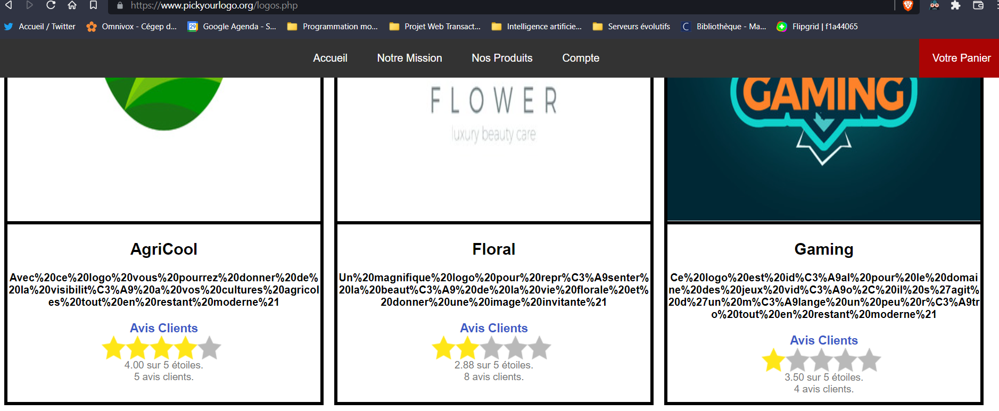
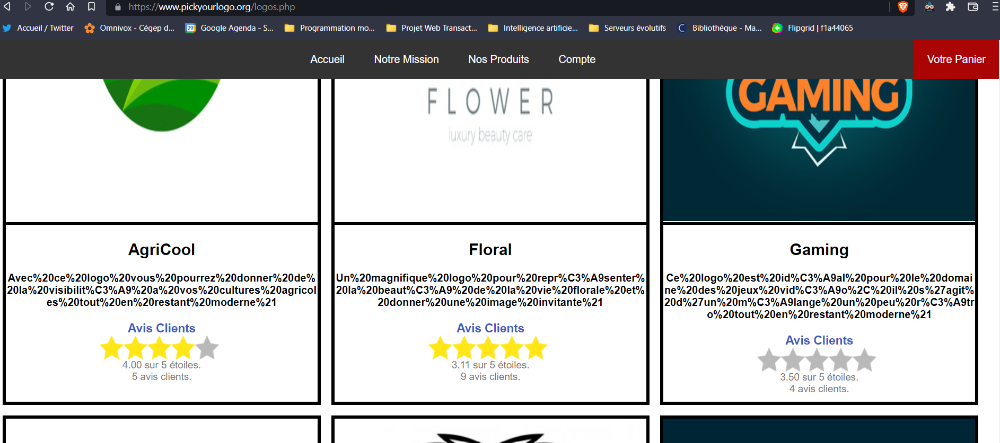
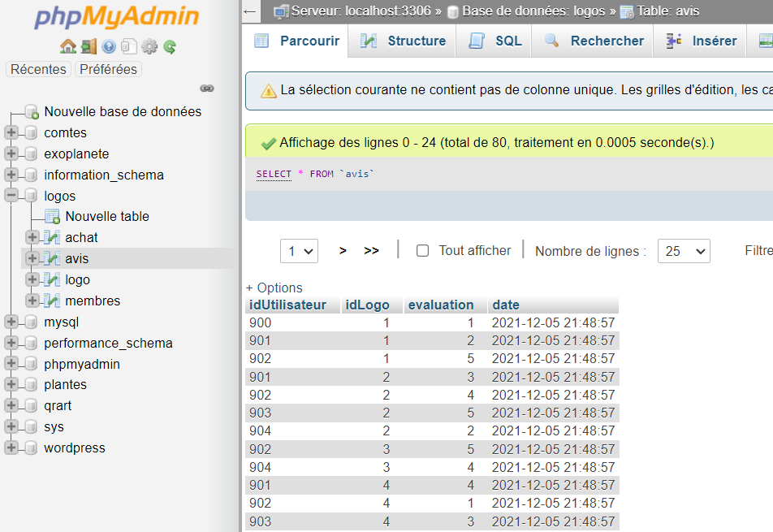

# Preuve de concept du projet AJAX évaluations clients

### 1. Affichage de la page logos.php

Sur la page qui liste tous les logos, les étoiles d'évaluations sont présentes sur chaques logos.

### 2. Ajout d'évaluations

Il est possible d'évaluer les logos un par un et le résultat est visible en temps réel sur le site. Les données des avis sont mises à jour. 

### 3. La base de données est fonctionnelle

La base de données est fonctionnelle et correspond avec les données envoyées.

